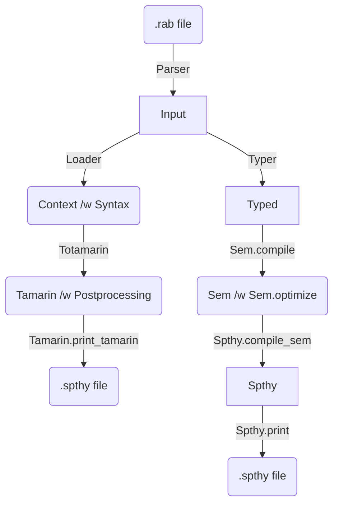

# Compiler pipeline

The current (new) compiler pipeline refactors the legacy compiler to provide a cleaner
implementation.

## Use of the new compiler

The `rabbit` command takes the following options for the new compiler:

- `--old`: It replaces the compilation with the legacy compiler pipeline;
  the legacy compiler generates the final output .spthy file specified 
  by the `-o xxx.spthy` option.
- `--test-new`: Use the new compiler pipeline along with the legacy.
  The legacy compiler generates the final output .spthy file specified 
  by the `-o xxx.spthy` option. In addition, the `xxx.spthy.2` file is generated
  by the new compiler. It also compares the success and failure of
  the `Loader` (the legacy source checker) and `Typer` (the new one).

Note: `--new` and `--test-new` are mutually exclusive.

## New compiler pipeline stages

The new compiler pipeline consists of the following stages:

- `Typer`: Name checking
- `Sem`: Compilation to a transition graph
- `Spthy`: The final output to Tamarin’s .spthy code.

Here is a diagram of the original and new compilation pipelines:

### Typer, name checker

Note that this is not really typing but just checking name occurrences to
reject the unbound use of names. It however uses a similar technique to 
static typing, thus called `Typer` and its output AST is called `Typed`.

Module `Typed` defines yet another version of the Rabbit AST than `Input`
and `Syntax`. It provides a cleaner implementation:

- A variable name is no longer `Name.t`, a simple string, but `Ident.t`, a string
  paired with an integer stamp, to avoid name reuse confusions.
- Variants without a parameter and with a parameter are unified.
- Variant arguments are labeled for better identification.
- The name-checking environment `Env.t` is attached to each AST node.

`Typer.load` takes a filename of Rabbit code. The code is first parsed 
by `Parser` to a list of `Input.decl`. The input declarations are then
name-checked by `Typer` and rejected if there is any unbound use of names.
If there are no erroneous uses of names, `Typer.load` returns a list of
`Typed.decl`, Rabbit declarations annotated with name-checking environments.

### Subst, process instantiation

Module `Subst` instantiates process definitions `Typed.Process` to `Subst.proc`
and `Subst.proc_group_desc` for each process group in a system declaration:
`p(ch1,..,chn)` and `!n.(p<e>(ch1,..,chn) | .. | p<e>(ch1,..,chn))`.
In the instantiated processes, variables are properly renamed with fresh 
integer stamps to avoid name crashes.

### Sem, the semantics as a transition graph

Module `Sem` defines `Sem.t`, the semantics of a Rabbit system as a transition
graph. It also provides an optimization: compression of transition graph edges.

`Sem.compile` takes a list of `Typed.decl` and compiles it to `Sem.t`:

- The processes declared in a system are first instantiated 
  by `Subst.instantiate_proc_group`.
- Each instantiated process is compiled to a transition graph 
  of `Sem.edge list`.
- The processes `Pi` in a process group `!n.(P1|..|Pn)` are compiled together.
- The channel access allowances by system calls (by system call names) 
  and in process code (by name `.` in `allow` declarations) are compiled 
  for each instantiated process as `access_controls`.
- The other members of a system: `signature`, `constants`, and `lemmas` are
  also gathered and compiled.

The type of facts `Typed.fact` is extended to `Sem.fact` with new facts
`Fresh`, `Structure`, `Loop`, and `Access` introduced by the semantic compilation.

If the `--svg` option is given, transition graphs of a compiled system are rendered
using Graphviz to an SVG file.

### Spthy, the final output to Tamarin

Module `Spthy` compiles the semantics `Sem.t` to `Spthy.t` by converting 
transition graph edges to Tamarin rules `Spthy.rule`.

The fact type is extended again in `Spthy` with constructors `Const`,
`Initing_const`, `Initing_proc_group`, `Inited_proc_group`, `State`,
and `Transition`.

Once compiled to `Spthy.t`, it is printed by `Spthy.print` to the final
Tamarin .spthy code. How the `Spthy` facts are converted to Tamarin facts
is defined by `Spthy.string_of_fact`.
